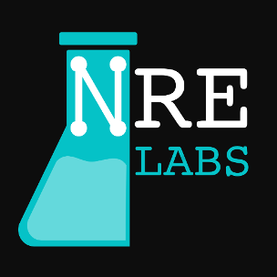

# Welcome!

[NRE Labs](https://nrelabs.io/) is an open-source project and website for making it easy to learn advanced infrastructure topics like automation. It accomplishes this by using real virtual environments that are provisioned on-demand and presented interactively in your web browser.

It's powered by the [Antidote](https://github.com/nre-learning/antidote) platform, which provides an abstraction to enable curriculum-as-code, meaning all learning materials can be represented as simple text files, stored in a Git repository.

This documentation is intended for people who want to get involved in contributing to the NRE Labs project. If this describes you, please follow the navigation to the left. It's probably best to follow it from top to bottom. However, if you're looking for more information about the project in general, head on over to [https://nrelabs.io](https://nrelabs.io).

> This documentation is managed by [Gitbook](https://www.gitbook.com/) and the source is hosted in the [nrelabs-docs](https://github.com/nre-learning/nrelabs-docs) repository.
