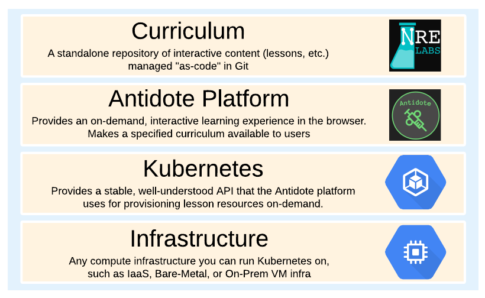

# Architecture

Antidote is a platform for providing an on-demand, interactive learning experience that removes all of the usual complexity of setting up your own lab environment, and instead does it all behind the scenes, giving the user a purely web-based portal to interact with.

To make this happen, Antidote plays a role in a broader technology stack, which we'll overview below:

### Curriculum

All of the lessons and labs are defined as a standalone curriculum. This model makes it easier for contributors to develop interactive content - they don't need to be web developers to add content to the NRE Labs experience.

The Antidote platform is built to treat this as a modular component. For instance, the [NRE Labs curriculum](https://github.com/nre-learning/nrelabs-curriculum) is the flagship curriculum that is powering the [NRE Labs](https://nrelabs.io) site, but it is possible to develop a different curriculum and deploy it on top of Antidote if you wish, in your own environment. 

### Platform

This is where the custom software components of Antidote live. In particular, [Syringe](https://github.com/nre-learning/syringe) __provides an upstream API for provisioning lesson resources, then makes the relevant calls to Kubernetes to make sure the relevant, specific compute resources and policies are instantiated_._ [Antidote-web](https://github.com/nre-learning/antidote-web) consumes the API offered by Syringe and is responsible for providing a fully web-based experience for interacting with lesson resources.

### Kubernetes

Kubernetes was selected as a common substrate for the Antidote platform for better portability between cloud providers or on-premises deployments. Aside from performance considerations, the underlying cloud or bare-metal infrastructure doesn't matter; as long as the Antidote platform is deployed on a Kubernetes cluster, that's all that matters. We recommend running Kubernetes on a bare-metal cluster \(while not strictly required\), and it must support CNI.

> Why not Hosted Kubernetes? There are two main constraints we need to solve before moving into something like GKE:
>
> * There is currently no hosted Kubernetes offering that gives the performance of bare-metal. For the NRE Labs site, this is absolutely necessary.
> * The current networking model uses a CNI plugin to make the lesson networking work. All of the existing hosted kubernetes options from the major cloud providers have rather strict networking models and don't let you bring your own CNI plugin.

### Infrastructure

This part is a lot more flexible. While we recommend baremetal for performance reasons, there's no technical requirement for it. Anywhere you are able to stand up a Kubernetes cluster should work, such as on-prem servers, virtualization environments, cloud \(IaaS\), etc.

## Lesson Resources

Lesson resources will be started over the infrastructure for each connected learner in parallel, isolated, according to the lesson specification.

Lesson resources will typically be inter-networked Kubernetes PODs \(containers\) which will be available for each learner.

In the following figure, the platform runs the same example lesson for 2 learners in parallel. Each lesson instance contains 2 resources \(`vqfx1` and `linux1`\), running inside their own Kubernetes "namespaces". A learner learner may then interact with the resources as dedicated virtual machines, using Web consoles connected via SSH to the right resources.

## 

* 
