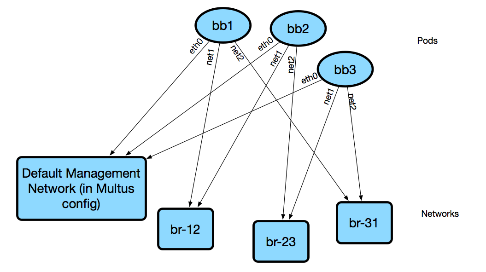

# High-Level Architecture

To know more about Antidote as a platform, it's important to first understand it's role in the greater stack, including the curriculum on top, as well as the infrastructure underneath.

### Curriculum

All of the lessons and labs are defined as a standalone curriculum. The platform underneath is built to treat this as a modular component. For instance, the [NRE Labs curriculum](https://github.com/nre-learning/nrelabs-curriculum) is certainly the most popular curriculum currently available, and it's what we are serving via the [NRE Labs](https://nrelabs.io) site, but no aspect of this curriculum is baked into the Antidote platform. Other curricula can be developed and run within the antidote platform.

### Platform

This is where the custom software components of Antidote live. In particular, [Syringe](https://github.com/nre-learning/syringe) __provides an upstream API for provisioning lesson resources, then makes the relevant calls to Kubernetes to make sure the relevant, specific compute resources and policies are instantiated_._ [Antidote-web](https://github.com/nre-learning/antidote-web) consumes the API offered by Syringe and is responsible for providing a fully web-based experience for interacting with lesson resources.

### Infrastructure

There is only one real requirement at this layer, which is Kubernetes. Kubernetes was selected as a common substrate for the Antidote platform for better portability between cloud providers or on-premises deployments. Aside from performance considerations, the underlying cloud or bare-metal infrastructure doesn't matter; as long as the Antidote platform is deployed on a Kubernetes cluster, that's all that matters. We recommend running Kubernetes on a bare-metal cluster \(while not strictly required\), and it must support CNI.

> Why not Hosted Kubernetes? There are two main constraints we need to solve before moving into something like GKE:
>
> * There is currently no hosted Kubernetes offering that gives the performance of baremetal. For the NRE Labs site, this is absolutely necessary.
> * The current networking model uses a CNI plugin to make the lesson networking work. All of the existing hosted kubernetes options from the major cloud providers have rather strict networking models and don't let you bring your own CNI plugin.

## Lesson Resources

Lesson resources will be started over the infrastructure for each connected learner in parallel, isolated, according to the lesson specification.

Lesson resources will typically be inter-networked Kubernetes PODs \(containers\) which will be available for each learner.

In the following figure, the platform runs the same example lesson for 2 learners in parallel. Each lesson instance contains 2 resources \(`vqfx1` and `linux1`\), running inside their own Kubernetes "namespaces". A learner learner may then interact with the resources as dedicated virtual machines, using Web consoles connected via SSH to the right resources.

## Lesson Networking

Kubernetes provides a lot of great primitives for managing the individual resources that make up a lesson programmatically, but with one major caveat - the networking model is not very conducive to running network devices. The popular use case for Kubernetes is to deploy simple applications within containers that have a single network interface, `eth0`.

Since we want to run network devices with multiple network interfaces that are connected together in a dynamic way, we need to do some creative stuff on the back-end to make things work. This is a part of the design that's still getting worked out, so the documentation on this will be necessarily light until we have a more solid foundation here. However, the TL;DR for how things currently work is as follows:

* Every Kubernetes pod is connected to the "main" network via its `eth0` interface. This is nothing new. However, because we're using [Multus](https://github.com/intel/multus-cni), we can provision multiple networks for a pod.
* When we schedule lesson resources, we use affinity rules to ensure all of a lessons' resources are scheduled onto the same host.
* Depending on the resource type, and the connections described in the [lesson definition](../object-reference/lessons/),

  we may also connect additional interfaces to a pod, connected to other networks.

* Since all pods are on the same host, if we need to connect pods together directly, such as in a specified network topology, we can simply create a linux bridge and add the relevant interfaces. In the future, we will do away with affinity rules and use overlay networking instead of the simple linux bridge.
* For security reasons, network access outside the lesson namespace is disabled. All lessons should be totally self-contained and not rely on external resources to properly function when the lesson is being run.

NetworkServiceMesh is an alternative to Multus that may allow us to accomplish the same goal of running multiple network interfaces out of a pod, but without the requirement of using a custom CNI plugin. It also doesn't directly integrate with whatever CNI plugin IS in use \(we ran into some issues with Weave+Multus, which is why we use linux bridges and therefore host affinities\). Further exploration is needed, but if NSM satisfies performance and scale considerations, we're seriously considering moving to it.

DNS in Antidote is [provided by Kubernetes](https://kubernetes.io/docs/concepts/services-networking/dns-pod-service/) So, if you want to reach vqfx1, simply query for `vqfx1`. You will be directed to the corresponding service in your namespace. Note that each lesson + session combination gets its own namespace, which means `vqfx1` is locally significant to your lesson specifically.

