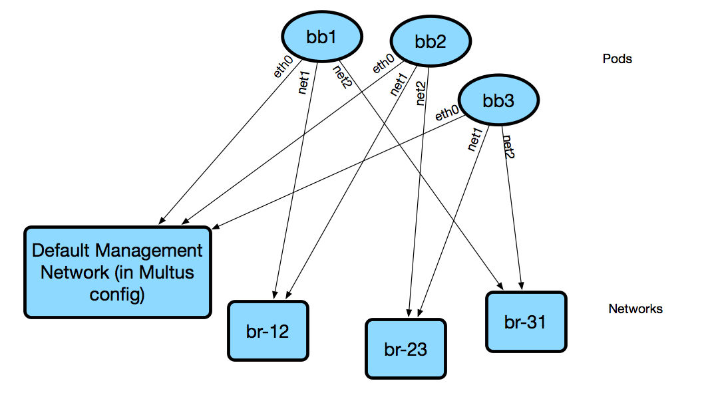

# Lesson Networking

Kubernetes provides a lot of great primitives for managing the individual resources that make up a lesson programmatically, but with one major caveat - the networking model is not very conducive to running network devices. The popular use case for Kubernetes is to deploy simple applications within containers that have a single network interface, `eth0`.

Since we want to run network devices with multiple network interfaces that are connected together in a dynamic way, we need to do some creative stuff on the back-end to make things work. This is a part of the design that's still getting worked out, so the documentation on this will be necessarily light until we have a more solid foundation here. However, the TL;DR for how things currently work is as follows:

* Every Kubernetes pod is connected to the "main" network via its `eth0` interface. This is nothing new. However, because we're using [Multus](https://github.com/intel/multus-cni), we can provision multiple networks for a pod.
* When we schedule lesson resources, we use affinity rules to ensure all of a lessons' resources are scheduled onto the same host.
* Depending on the resource type, and the connections described in the [lesson definition](../object-reference/lessons/),

  we may also connect additional interfaces to a pod, connected to other networks.

* Since all pods are on the same host, if we need to connect pods together directly, such as in a specified network topology, we can simply create a linux bridge and add the relevant interfaces. In the future, we will do away with affinity rules and use overlay networking instead of the simple linux bridge.
* For security reasons, network access outside the lesson namespace is disabled. All lessons should be totally self-contained and not rely on external resources to properly function when the lesson is being run.

NetworkServiceMesh is an alternative to Multus that may allow us to accomplish the same goal of running multiple network interfaces out of a pod, but without the requirement of using a custom CNI plugin. It also doesn't directly integrate with whatever CNI plugin IS in use \(we ran into some issues with Weave+Multus, which is why we use linux bridges and therefore host affinities\). Further exploration is needed, but if NSM satisfies performance and scale considerations, we're seriously considering moving to it.

DNS in Antidote is [provided by Kubernetes](https://kubernetes.io/docs/concepts/services-networking/dns-pod-service/) So, if you want to reach vqfx1, simply query for `vqfx1`. You will be directed to the corresponding service in your namespace. Note that each lesson + session combination gets its own namespace, which means `vqfx1` is locally significant to your lesson specifically.

