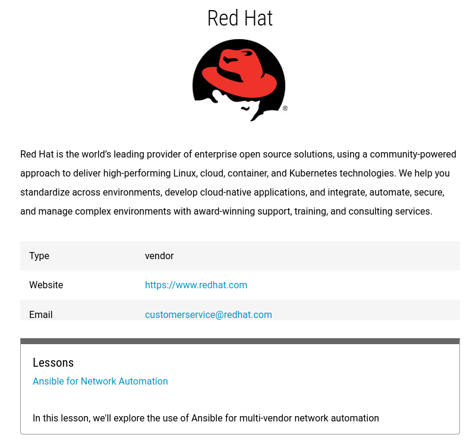

# Collections

With any curriculum, there are natural categorizations that arise from its content. For instance, in the automation space, you have fundamental skills, tools, and then the application of those tools. Further, you have categorization within each of those - maybe according to language or level of difficulty.

Sometimes a second axis of categorization is needed. Some lessons which have little to nothing in common technically, are tightly aligned around some other theme. For instance, a group of technically unrelated lessons might all be contributed by the same organization, and it would be nice to be able to see them all in one place, with some references to where users can learn more about that organization. Or maybe some lessons operate under some kind of constraint, such as only being useful on a certain vendor's equipment.

Enter collections. These are a new resource type in Syringe that allows you to define all of the metadata necessary for describing such a grouping. Just like other resource types, collections are defined in a simple YAML definition, and Antidote takes care of nicely rendering it in the web UI:



Once defined, other resources like lessons are able to reference the ID\(s\) of the collection they belong to, if applicable. See the `collection` field in [lesson definitions](lessons/).

> An important note, especially if you're looking to create a collection for your company. This is totally acceptable - nay, encouraged - as long it's done the right way. Collections aren't a sales pitch. You can talk about your company and give a brief overview, but stay away from language like "we're the best" in favor of simply and succinctly describing what you do, why you have contributed to NRE Labs, and what users can expect to see from you here.

## Defining a Collection

Defining a collection is fairly straightforward. There's a bit of metadata, and a few description fields for you to populate. There are also some fields for pointing users to a relevant website or contact email, where appropriate. This is useful to give users a place to go after they find your content, and want to find out more about the person or organization behind it.

```text
---
id: 7
title: Red Hat
image: https://raw.githubusercontent.com/nre-learning/nrelabs-curriculum/master/collections/redhat/redhat.jpg
website: https://www.redhat.com
contactEmail: "customerservice@redhat.com"

# Why should users view your collection?
briefDescription: |
    Red Hat is the world’s leading provider of enterprise open source solutions, using a community-powered approach to deliver high-performing Linux, cloud, container, and Kubernetes technologies.

# Why should users continue and view your lessons?
longDescription: |
    Red Hat is the world’s leading provider of enterprise open source solutions, using a community-powered approach to deliver high-performing Linux, cloud, container, and Kubernetes technologies.
    
    We help you standardize across environments, develop cloud-native applications, and integrate, automate, secure, and manage complex environments with award-winning support, training, and consulting services.

type: vendor
tier: prod

```

This collection definition is just an example. You should look at the [existing collection definitions](https://github.com/nre-learning/nrelabs-curriculum/tree/master/collections) for inspiration. Note also that not every field picture above is required. Some are optional. Using the`syrctl validate` command will be useful for identifying which fields you need to provide no matter what.

As with lesson definitions, follow the [NRE Labs curriculum contribution guide](../../creating-contributing/contributing-content/) in order to get your collection added to the NRE Labs curriculum.

