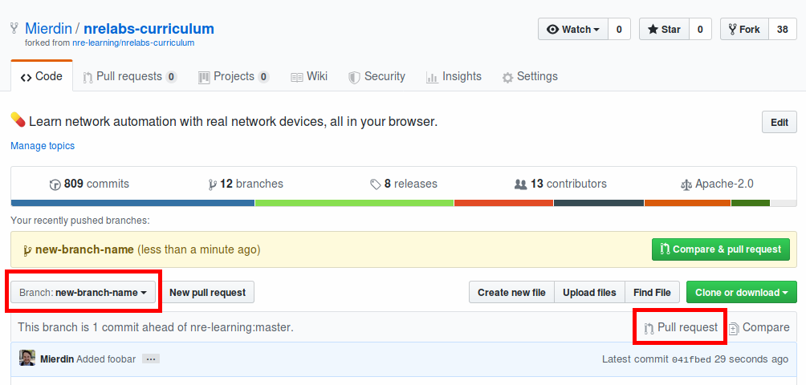
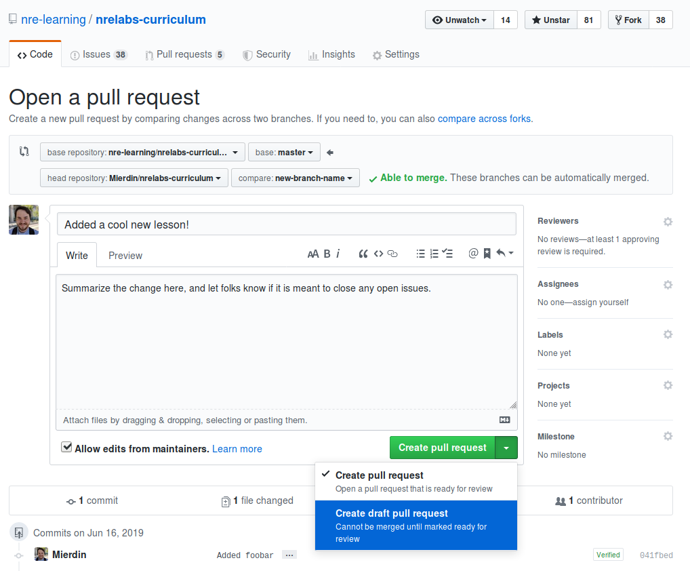
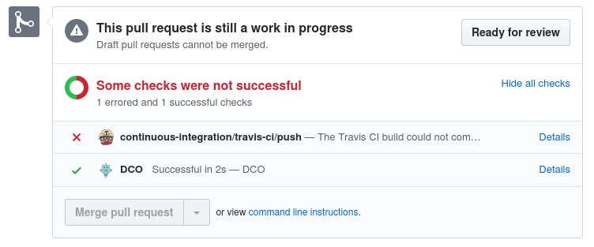

# Open a Pull Request

In [First Steps](getting-started.md), you learned to use the `antidote`CLI tool to bootstrap and validate your new content. It is now time to push these changes to GitHub, and open a Pull Request. This will allow you to use the [Preview Service](preview-your-changes.md) to see your new content in action, as well as eventually get this content merged into the main curriculum repository.



## Commit and Push

Once you've made some changes, you might be wanting to save your progress in Git so that you can track your progress. It's generally good practice to [make commits](https://git-scm.com/book/en/v1/Git-Basics-Recording-Changes-to-the-Repository#Committing-Your-Changes) somewhat often so that if you make mistakes, you can roll back easily.

Once you've made some commits, you'll want to "push" them. This ensures that the branch you have locally is replicated to your fork:

```text
git push origin <your branch>
```

## Create a Pull Request

Once you have commits pushed, you can open a Pull Request, which is a way of saying "I have changes in my fork that I would like you to pull into the main repository". You may feel like you should wait to open a Pull Request until you're "done", which is totally okay. However, opening a Pull Request early, even right as you're starting work is not only okay too, but also encouraged. Any commits you push after opening the Pull Request will get added automatically, and it gives you a chance to open a dialog with reviewers. So don't be afraid to go down this path early.

If you navigate to the GitHub page for your fork, you'll notice that there's a little bar that says you're X commits ahead of the main repository, with some buttons next to it that let you open a Pull Request:



Make sure the correct branch is selected in the drop-down to the left, and then click "Pull Request" on the right. This will take you to the upstream repository to open a new Pull Request:



Be descriptive here - let folks know what you're working on and what state it's in. Feel free to use the description to summarize any outstanding work you have to do, if you're not quite finished.

Note the dropdown gives two options for opening a Pull Request. If you're not finished with your work, feel free to open a "draft" pull request - this gives reviewers a clear signal that you're not done, so any comments will be given in that light.

## Fixing Problems

When you open a Pull Request, there are a number of automated processes that take place. First, a series of automated checks run on your contribution to ensure it meets basic technical standards. The [Antidote CLI tool](../antidote/the-antidote-cli/) is actually used behind the scenes to validate the syntax of all curriculum resources, and a few additional scripts kick off to do basic housekeeping things like ensuring the CHANGELOG is updated.

If any of these checks fail, the GitHub status checks will indicate this failure. Reviews or automated reviews won't take place until these checks pass, so if you see a failure, click through to the TravisCI build information to see where the failure happened.



Once your Pull Request is open, you're ready to start using the [Preview Service](preview-your-changes.md) to see a live preview of your changes.

