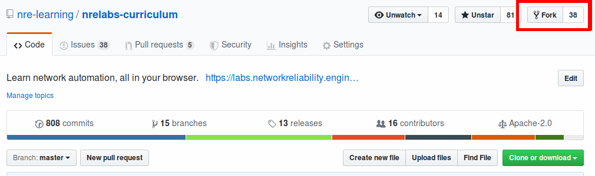

# First Steps

So, you want to contribute to the NRE Labs curriculum! Great, and thank you! Please read on for some helpful hints that will guide you along the process and ensure your time is spent wisely.

Before you get started, please read the [NRE Labs Curriculum Standards](https://github.com/nre-learning/nrelabs-curriculum/blob/master/CONTRIBUTING.md). This is **the** document used by all content reviewers to ensure curriculum quality remains high, and all contributions must adhere to these standards.

> **NOTE for Open Source Maintainers -** we would love the opportunity to host tutorials for your project. If you've created or are maintaining an open source project you should have the right of first refusal for contributing a lesson on your project in the NRE Labs curriculum.

Some helpful tips before getting started:

* **Communicate your Idea** - The NRE Labs curriculum should be treated like any other open source project. It's built via contributions from all over the world, all the time. So before getting started, you should first spend time communicating your plans with the rest of the community. Peruse the [existing GitHub issues](https://github.com/nre-learning/nrelabs-curriculum/issues) to see if anyone is already working on something similar to what you have in mind. Maybe someone else is looking to build a similar lesson, and this gives you the opportunity to let them know, and combine forces. lf you are looking to collaborate on a lesson, [opening an issue](https://github.com/nre-learning/nrelabs-curriculum/issues/new) is often a good way to see if anyone in the community is interested in helping out.
* **Do You Need New or Changed Images?** - If your lesson will require new software images not already in the curriculum \(or edits to an existing image\), we have a dedicated document for handling [Endpoint Images in NRE Labs](../other-resources/nre-labs-endpoint-images.md), and you should definitely read this first. In the event that you need a new image or a modified image for your lesson, this must be handled **first**, ahead of any content contributions that may need them.

## Create a Fork and Branch

The NRE Labs curriculum is maintained on [GitHub](https://github.com/nre-learning/nrelabs-curriculum). As is the case with many open source projects, contributing to the NRE Labs curriculum involves a workflow called "Fork and Pull". This workflow involves making your own copy of the curriculum \(known as a "fork"\), making changes there, and then submitting a Pull Request to bring your changes back into the main curriculum repository.

If you're not familiar with Git, we actually [have a lesson that you might find useful](https://nrelabs.io/labs/?lessonSlug=git-version-control&lessonStage=0). It's not specific to the NRE Labs curriculum, but if you're totally new to Git, it deals with all of the fundamentals you'll need to return to this document and follow the instructions to contribute to the curriculum.

> Before you get started, please ensure you've [added your SSH key to your GitHub profile](https://help.github.com/en/github/authenticating-to-github/adding-a-new-ssh-key-to-your-github-account). These instructions will assume that you've already done this, and will use SSH-based URLs for cloning and pushing commits.

To do this, click the "Fork" button in the top right of the [NRE Labs Curriculum repository](https://github.com/nre-learning/nrelabs-curriculum):



Next, GitHub will ask you where you want to place the fork. Remember, this is like making a copy, so it's asking where you want the copy of that repository to go. Usually, people select their own username. Doing that will result in a repository under your own GitHub username like so:

```text
https://github.com/<your username here>/nrelabs-curriculum
```

Now that you have created a fork, you need to create a **local** copy of that fork so that you can actually work with the files. This is called ["cloning" the repository](https://git-scm.com/book/en/v1/Git-Basics-Getting-a-Git-Repository#Cloning-an-Existing-Repository):



```text
git clone git@github.com:<insert your username here>/nrelabs-curriculum.git
cd nrelabs-curriculum/
```



```
git clone http://github.com/<insert your username here>/nrelabs-curriculum.git
cd nrelabs-curriculum/
```



This will result in a new directory at your current path called`nrelabs-curriculum`. Next, enter this directory and create a new branch \(replacing `new-branch-name`with the name of your choice\):

```text
cd nrelabs-curriculum/
git checkout -b new-branch-name
```

## Bootstrap Your Content

Next, you'll need the [Antidote CLI](../antidote/the-antidote-cli/). This is the command-line tool for bootstrapping new content for NRE Labs like lessons. Install this tool using the instructions provided, and then [follow the instructions here](../antidote/the-antidote-cli/create-curriculum-resources.md) to bootstrap a new curriculum resource such as a lesson. These interactive wizards will create a skeleton copy of a new resource within your existing curriculum directory, which you can then use as a starting point.

Once finished with the initial bootstrap, you'll also want to [validate your local curriculum](../antidote/the-antidote-cli/validating-an-existing-curriculum.md). This validation step can identify any problems with what you've built, and is a necessary next step after the initial bootstrap. The NRE Labs CI pipeline uses this command to validate that the curriculum is well-formed, so it's worth it to run this locally yourself first.

If you run into problems here, you may consider moving to the next phase, and open a pull request anyways. This way, maintainers will be able to see what you've done thus far, and provide suggestions.


