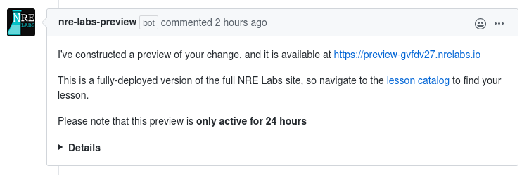

# Preview Your Changes

> This portion of the contribution pipeline is new, and still under active development. If you encounter issues here, you may consider following the instructions for [getting a copy of the NRE Labs software running on your laptop](../other-resources/previewing-locally.md). This is the legacy way of previewing content, and does involve a lot more technical know-how, but is an option for you.
>
> Please [post to the forums](https://discuss.nrelabs.io/c/antidote-support/5) if you have issues with this documentation or the preview service.

Once all status checks for a given Pull Request pass, the NRE Labs Preview Service will automatically generate a live preview of your changes, and post these details via a comment in your Pull Request.

Note that previews are not generated if the branch doesn't pass the other CI checks, so if you're not seeing this, ensure that you aren't seeing any errors from Travis CI.

## Known Issues

This is a new service, and while the goal for this service is to make things **way easier** for contributors, it is a new service, so your patience and feedback is greatly appreciated. There are a few issues we are currently aware of:

* Due to the way our cluster certificates have been provisioned, HTTP presentations don't show up in previews properly
* We don't currently capture logs for configuration changes, only high-level Antidote setup. This catches basic validation errors on startup, but doesn't catch problems with inter-stage configuration scripts. In the meantime, if you are encountering configuration problems in a previewed lesson and don't know why, a maintainer may be able to help, so comment in your PR.

