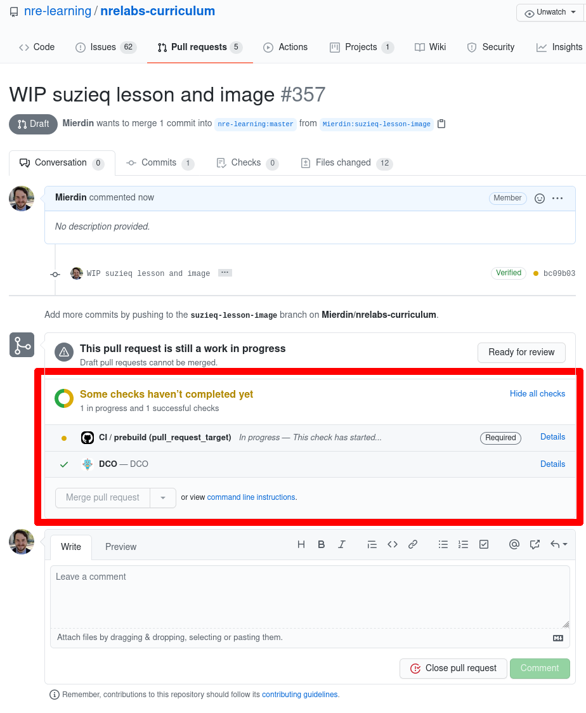
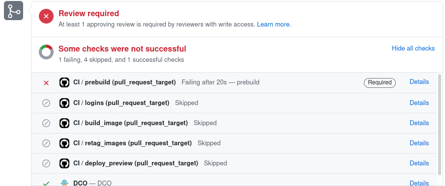
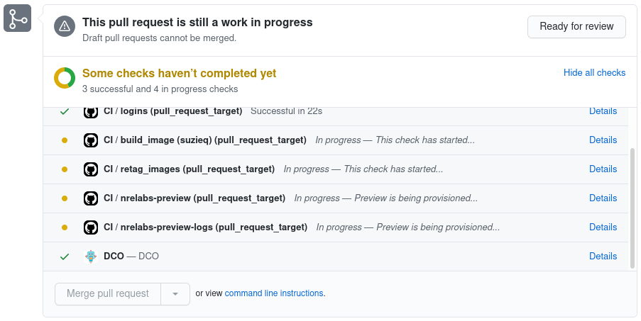
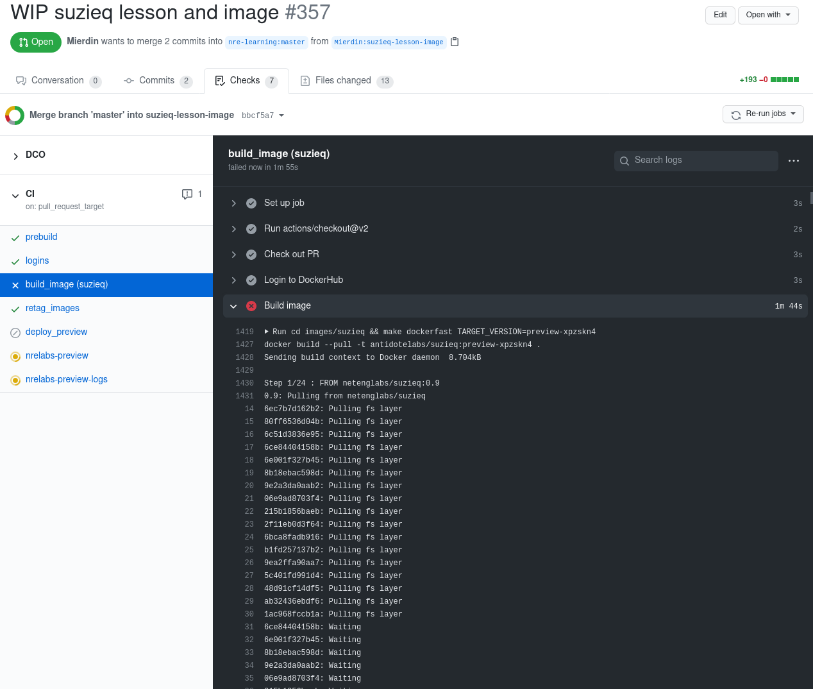
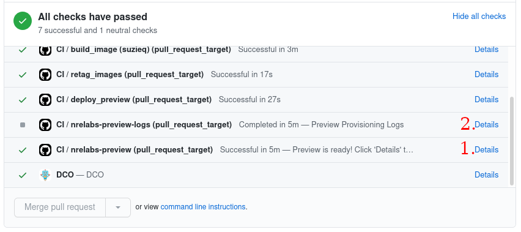
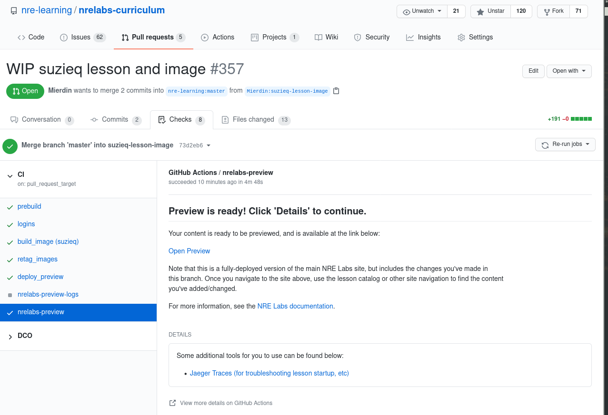

# Preview Your Changes

When building your content, eventually you'll reach the point where you want to see how it will appear on the NRE Labs site. This is possible simply by opening a Pull Request, which we covered in the previous step.

When you open a Pull Request, like any other software project, a series of automated checks take place to ensure some of the basics are in place. These include things like checking to make sure the CHANGELOG has been updated, some simple spellchecking, and validation of the lesson layout and metadata.

When you open a Pull Request, these checks immediate appear in the portion of the page highlighted in red below:



These basic checks happen first and if there are any problems here, the automated process stops, and will not continue until those problems are addressed.



At any stage, including failures like the one pictured above, you can click on "Details" to the right of each check, to get more information about the progress of each check. Note that all checks labeled "Required" **must** pass in order for your Pull Request to be accepted, but that doesn't mean that if it does pass that your PR can be merged immediately - other changes may be requested by project maintainers beyond the simple checks performed here.

If the initial checks do pass, your contribution will go through a build process, which should only take a few minutes or less. This process will first build any [endpoint images](../other-resources/nre-labs-endpoint-images.md) that have changed in your PR:



This is another step that could fail. For instance, if your image's Dockerfile contains some kind of error, or something else causes the build process to fail, the corresponding check above will fail, and you can click "Details" to view the build logs for that step. This will allow you to see exactly what failed, and identify a next step for fixing the problem.



> You should first ensure that your images [build on their own](../antidote/object-reference/images.md#building-an-image) on your local machine before pushing them into your Pull Request. Please do not use this system as a way of iterating through the creation of an image from scratch, but rather as a last step to ensure an image that you believe is close to being finished, truly satisfies the requirements of the NRE Labs platform.

Once you've made the necessary changes to resolve any problems that have come up until now, you should get something that looks like the below screenshot, indicating a successful preview deployment.



The check annotated with the number "1" is the main preview check, and you can click "Details" to be taken to a page that contains not only the link to your preview, but some other helpful troubleshooting information. The check labeled "2" contains logs for the preview infrastructure itself. Combined, these should provide you with some tools to troubleshoot if things go wrong, so do check them out.

If you click on "Details" for the main preview check, you'll see the following page:



When you click the "Open Preview" link contained there, you'll notice it will take you to a semi-random URL, like:

```text
https://preview-123abcde.nrelabs.io/
```

This is a randomly-generated URL for the preview for your pull request, and a new one is generated every time you make a change. This is not just a single lesson, but rather a self-contained instance of the **full NRE Labs platform**. This means that your preview URL will take you to what looks like the main NRE Labs site, but in fact this site is updated with the changes you've made. So, to see your changes, go through the lesson catalog and find your lesson, and launch it, just like you would on the main NRE Labs site.

More than likely, you'll still want to change things. Maybe the lesson works great, but you made a typo, or forgot to include a command in the lesson guide. Or maybe you forgot to install a dependency in the endpoint image. This is fine, and expected - simply continue to push commits to the branch you pushed as part of opening a Pull Request in the previous step, and a new preview will be built from the beginning.

> Please try to consolidate your commits, so the preview system can keep up with generating previews for everyone. Don't just push a bunch of small commits and minor changes, rather, try to bunch your changes into a few commits and push when you feel you have made all the changes you wanted to make. The project maintainers reserve the right to close Pull Requests and take other preventative actions in response to abusive behavior. If needed, maintainers may also request that you squash your commits prior to merging, or else they'll have to squash them on merge as a last resort.

