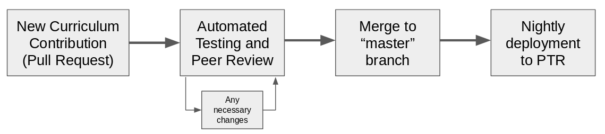

# NRE Labs Public Test Realm \(PTR\)

> **NOTE** - the PTR is currently offline. We recently re-launched NRE Labs at a new domain, and haven't yet rebuilt the PTR environment. Please bear with us as we figure out a good path forward.

To allow the community to see the latest changes in the curriculum, and help with testing them to ensure they're solid before going into production, a ["public test realm" \(PTR\)](https://ptr.go.nrelabs.io) is maintained separately from the production site. It can be thought of as a daily-updated release candidate for the NRE Labs curriculum.

> PTR is **not** meant to be used to test Antidote platform features. Both the production and PTR sites will be running the latest stable release of the Antidote platform for which a stable version of the curriculum has been released. The idea of PTR is to provide a sort of rolling release candidate for the curriculum itself.

The PTR is redeployed nightly from the latest `master` of the NRE Labs curriculum. This means that content that's gone through the proper approval process should show up automatically within 24 hours.

As a result, PTR is inherently not guaranteed to be stable, and content in PTR should not be thought of as "perfect". PTR is merely a representation of the current `master` branch of the curriculum - and because of that , it's gone through at least one level of review. However, the presence of content in PTR is not an indication that the content is ready for production - that will have to wait for the release cycle to end.

The flow of content from contribution to PTR is outlined below:

As outlined in the previous sections, the curriculum is built to target a particular stable version of the Antidote platform. Since the PTR is primarily used as a function of the curriculum, when a new curriculum release cycle kicks off, and a platform version is identified, this version will be deployed to the PTR.

All curriculum content contains a `tier` field, which can be set to `ptr` in order to ensure that the content only shows on the PTR. If content is deemed to be ready for production, it will be "promoted" by setting this field to `prod`. Note that content with a `prod` tier must still be captured into a stable release to actually make it to the production site.

