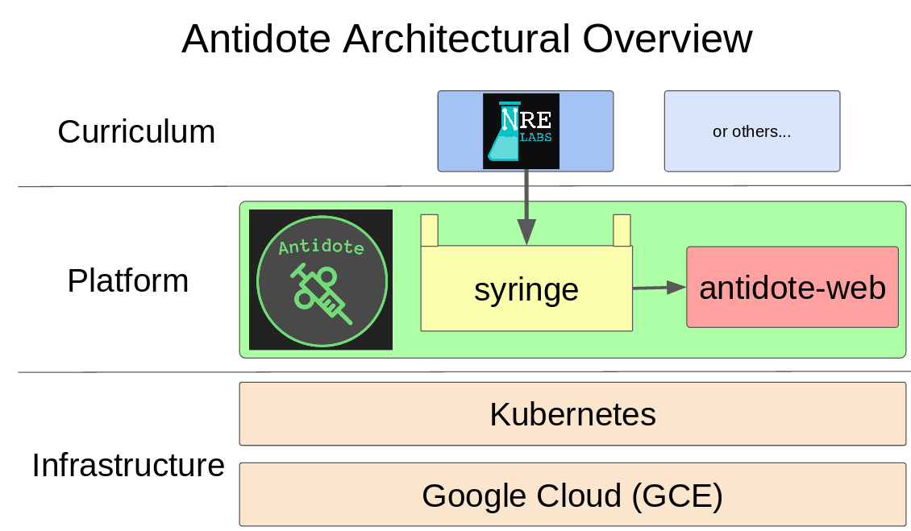

# What is NRE Labs?

[NRE Labs](https://labs.networkreliability.engineering) is an open-source project and website for teaching network automation using real virtual environments that are provisioned on-demand and presented interactively in your web browser.

It's powered by the [Antidote](https://github.com/nre-learning/antidote) platform, which provides an abstraction to enable curriculum-as-code, meaning all learning materials can be represented as simple text files, stored in a Git repository.

To power the site, we put all these pieces together to give users the opportunity to learn the subjects within the NRE Labs curriculum without having to set anything up on their own.

The documentation you're reading focuses on just one aspect to this stack, and that is the NRE Labs curriculum itself. These are the set of files that represent lesson content, collections, images and more that are shown in the website. We treat the NRE Labs curriculum as its own entity, with its own release cycle, versioning, contribution model, and documentation.

