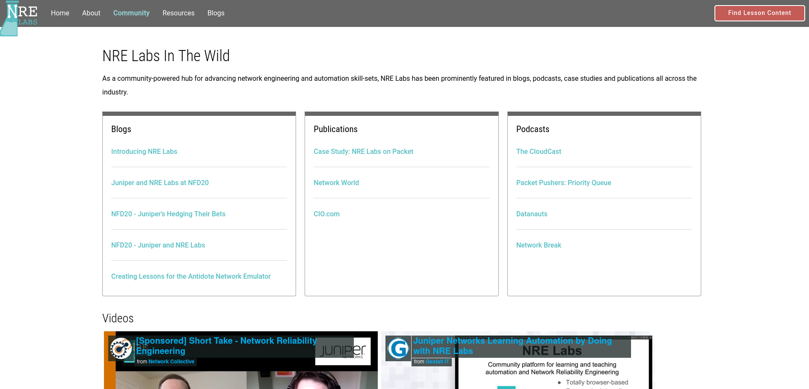

# Tools for Presenters

We maintain a page on the NRE Labs site called "[NRE Labs in the Wild](https://nrelabs.io/community/nre-labs-in-the-wild/)". We try to keep this updated with any presentations with public recordings that are either about or include NRE Labs.

If you'd like to give your own presentation on NRE Labs, both PDF and ODP formats [are available here](https://github.com/nre-learning/nre-resources/tree/master/presentations). Download these and modify as you need for your own NRE Labs presentations. This repository also houses other resources like hi-res logos that you might find useful.

The following video was recorded as an example for this presentation. You can use it as inspiration for your own presentation to whatever degree you wish:



