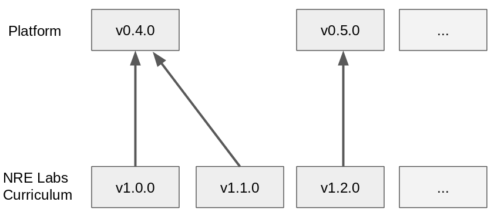

# Curriculum Release Process

The NRE Labs curriculum is managed like any software project, with regular, planned release cycles. The lifecycle of a curriculum release is performed in four discrete steps.

### Step 1 - Release Kickoff

A post will be created in the [Project Management](https://discuss.nrelabs.io/c/project-management/10) forum topic to notify everyone that the work on this release has begun, with the title "Release Kickoff...". This forum thread should serve as the center of all release planning discussions, and all are welcome to participate. If you have something you think should be included in or excluded from the release plan, speak up there.

In this first kickoff, we'll begin gathering ideas for things we want to get done in this release. These will be retrieved from various sources:

* Open issues or PRs in the curriculum repo - comb and triage; Which are ready to be worked on, or are most imminent?
* Ideas from the community not yet documented formally
* Tasks needed for updating the curriculum to be compatible with a new platform version \(if applicable\)
* Any tasks that need to be done to bring the existing curriculum in line with the targeted Antidote platform version

While the kickoff is meant to get a starter list together, it's likely that more ideas will come up at any time in the release cycle. This is normal, and expected. However, the first week of a release cycle should strive to ensure the really important things are well-documented and if possible, assigned.

Another very important task for this initial meeting is to decide which Antidote platform this curriculum release will [target](curriculum-release-process.md#appendix-platform-targeting). Once this is determined, the [preview service](../creating-contributing/preview-your-changes.md) will be updated to use this version to ensure compatibility.

A project plan for the release that represents the work discussed in the previous week will be posted to the [projects list](https://github.com/nre-learning/nrelabs-curriculum/projects) and presented to attendees. This is a kanban-board style project planning tool that allows all to easily see the state of work for a given release.

Finally, a post will be created in the [Project Management](https://discuss.nrelabs.io/c/project-management/10) forum topic to notify everyone that the work on this release has begun, with the title "Release Kickoff...". This forum thread should serve as the center of all release planning discussions, and all are welcome to participate. If you have something you think should be included in or excluded from the release plan, speak up there.

> Not all work fits neatly into a release plan, and that's okay. Especially in the curriculum, contributions of any kind can reasonably take place at any time. The purpose of a release plan isn't to put limits on the work that can be done for a release, but rather to ensure that the important things that really **need** to get done are accounted for. If you want to work on something that's not explicitly asked for in the release plan, that's totally fine.

### Step 2 - Development Work

Once a release cycle is kicked off, the only thing left to do is....do the work! At this point, a relatively complete list of things to do for this release should be captured in a Github project, which will be linked to in the community forum kickoff post. Contributors can use this as a guide, or do other work they think is useful.

The [curriculum contribution guide](../creating-contributing/contributing-content.md) should be consulted repeatedly to ensure you're on the right track with respect to curriculum contributions. All of those guidelines apply here. It's important for contributions to follow this lifecycle, so that release managers can properly coordinate work across the project.

### Step 3 - Testing Phase

At some point, the list of tasks that are meant to be tackled for a given release are complete, and it's time to initiate the process of cutting a release, and getting it into production.

The first step in this process is to ensure the latest changes in the `master` branch of the curriculum are properly represented in the PTR. This should automatically happen nightly, but someone from the NRE Labs Ops team will make sure this is true.

A forum topic will be posted to [Curriculum Project Management](https://discuss.nrelabs.io/c/curriculum-project-management)\_ with the title "Testing Curriculum Release vX.X.X". This will contain a link to the testing procedure, and a summary of the CHANGELOG at that point in time, so that new content can be tested properly. For a minimum of seven days from the date of the post, contributors should test the site as it exists in PTR, and submit feedback.

The best way to provide feedback is via a response to that original forum topic, or a Github issue in the curriculum repository.

> Instead of submitting feedback, you may feel like you can just fix it yourself in a Pull Request. This is always welcome and appreciated, and is often the easiest way to make your first contribution to the curriculum. So, don't be shy! See the [curriculum contribution guide](../creating-contributing/contributing-content.md) for more info on how to do this.

The curriculum maintainers will stay on top of feedback and strive to ensure that all problems are either fixed via a Pull Request, or documented via an Issue for a future release. The Testing Phase will not end until the maintainers are comfortable that the latest `master`, as represented via the PTR site represents a healthy curriculum.

### Step 4 - Release and Deployment

Once the testing phase has completed, the NRE Labs Ops team will execute a workflow that creates the target version release for the curriculum, and will deploy this version to production.

In addition, if this curriculum release is meant to target a new version of the Antidote platform, the production site should also be updated accordingly.

In the following week \(or at most two\), the cycle will repeat, and a new release kickoff will take place.

### Appendix - Platform Targeting

The NRE Labs curriculum is released separately from the underlying Antidote platform. As a result, the platform's release cycle will charge ahead with new features, and it's up to the curriculum release planning to "target" a stable version of the platform to develop against. The below image shows an **example** of how this might work:

At the time the curriculum started on its own release cycle, `v0.4.0` of the platform was released simultaneously with `v1.0.0` of the NRE Labs curriculum. In the future, the curriculum may want to release a new version before `v0.5.0` of the platform is ready. In this case, the curriculum, starting with `v1.1.0` will continue to target `v0.4.0` until a suitable stable platform release is ready.

