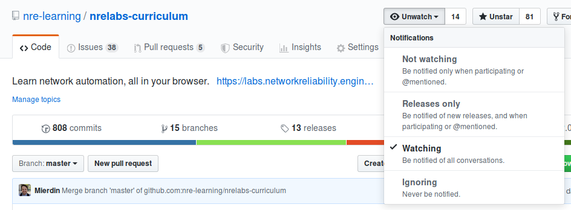
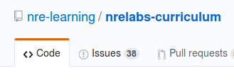
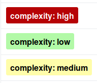

# NRE Labs Git Repositories

The Antidote project does everything in the open. All configurations, curriculum resources, and source code can be found in one of the GitHub repositories in the [`nre-learning`](https://github.com/nre-learning) organization. As a result, no matter where you want to contribute to the Antidote project, you're likely able to do so by contributing to one of these repositories.

However, not everyone that wants to contribute knows how Git works, and even for those that do, the way the Antidote project uses Git to accept contributions may not exactly match with previous experience. This document is aimed at covering everything you'll need to know to contribute to any Antidote repository. Other pages within this documentation explain the specifics of contributing to the curriculum, the underlying platform, the development environment, or even the documentation itself, but they all have one common theme - at some point, in order to contribute, you will need to work with Git or Github.

So, those pages will focus on the specific details and repositories they cover, but will inevitably link here. So, this document will apply to any Git repository those pages might reference, even though we'll use some specific examples here for illustrative purposes.

> This is **not** meant to be a tutorial on Git or Github. While you certainly don't need to be a Git expert to work with Antidote repositories \(especially if you're only interacting with Github\), you will always be well-served to get some basics under your belt. This [`basic introduction`](https://git-scm.com/book/en/v1/Git-Basics) __is highly recommended reading, and we will be making some references to the terms contained within. In addition, if you don't have a Github account, sign up for one [here](https://github.com/join). There's really no getting around it, if you wish to interact with the Antidote project in nearly any capacity.

The [`nrelabs-curriculum`](http://github.com/nre-learning/nrelabs-curriculum) __repository is probably one of the most popular repositories in the Antidote project. While not technically part of the Antidote platform, it is the flagship curriculum developed for the platform, and is what powers the [NRE Labs](https://nrelabs.io) site. For the vast majority of examples, we'll be using this repository to illustrate the concepts, but for the most part, everything applies to any Antidote repository.

## "Watching" for Activity Notifications

One of the easiest ways to start getting involved with the Antidote project is to just pay close attention to what's going on. In addition to making sure you're aware of new threads on the [`community site`](https://discuss.nrelabs.io/)\(which you should totally do\), a leading way to do this is to "Watch" the Antidote repositories relevant to you. You can do this by navigating to one of the repositories, and clicking the "Watch" drop-down at the top right of the page:

Make sure you also take a look at your [notification settings](https://github.com/settings/notifications) to ensure that not only are you notified for new issues and Pull Requests, but also that the email address is one that you check often. Notifications at this level are always relevant and technical, and represent the true nature of discussion going on with the project. So if you're willing to turn notifications on for anything, this is the time to do it.

## How and When to Open an Issue

Without a doubt, the [`community site`](https://discuss.nrelabs.io/) is the best place to go for general discussions and support with developing lessons, or even working with code on the Antidote platform. However, sometimes it's necessary to make more of a definitive statement, such as "I think I'm encountering a bug, here's what I'm seeing", or "I really with Antidote did X". In these cases, where such a statement may not have an immediate answer but clearly represents some level of work to satisfy, a Github Issue is often the best place to post that.

> In some cases, project leaders will provide guidance when something is or isn't appropriate as a Github Issue. In fact, sometimes it's not immediately clear if an Issue is warranted until the conversation has taken place elsewhere first. In general, don't stress out too much about when something is or isn't appropriate as an Issue, but be willing to move where the conversation needs to go.

Issues aren't restricted only to folks to have pushed code or other content to a repository. If you have constructive feedback, that is just as valuable a contribution, and opening a new Issue is a great way to do that. Examples include:

* Bug reports \(even if you're not quite sure it's a bug\)
* Feature requests
* Help with an error

Every repository has an "Issues" tab that you can click to take you to the currently open Issues for that repository:

There's a big green button at the top left of that page \(once you click the Issues tab\) that said "New Issue". Clicking that will take you to a form where you can provide a title and description. For some Antidote repositories, these fields will be pre-populated with a framework of the kind of information that would be very helpful to anyone that looks into things for you. In general, follow the guidance that's there, but post as much detail as you can, and be ready to provide more if asked.

## Using Issues to Identify Low-Hanging Fruit

If you have poked around at the open issues, you may notice that some of them have colorful tags attached to them. Github calls these "labels", and they are useful for providing additional categorization for issues or pull requests.

Lots of folks approach open source projects with some enthusiasm and willingness to get involved, but often don't know where to start. It's pretty difficult to look at a list of bug reports and have any idea how far the rabbit hole goes for any of them. The best way to get started with a project is to take on a task that gets you that experience without requiring you to spin your wheels for weeks, which is super demotivating.

For you, we've created complexity ratings in the form of Github Issue labels, and try our best to apply them to each issue on the Antidote repositories:

These are things like enhancements or bugfixes that we've set aside that are relatively approachable, and don't require you to know how everything works in order to satisfy them. What this means for you, is you can easily get a look at a repositories low-hanging fruit tasks by filtering issues by the `complexity: low` label. For the `nrelabs-curriculum` repository, [this URL gets you straight there](https://github.com/nre-learning/nrelabs-curriculum/labels/complexity%3A%20low).

However, nearly all Antidote repositories have the same taxonomy, so no matter where your interests lie, this mechanism is in place for you to identify those "entrance ramp" tasks. If you lean more towards web or front-end development, the [complexity: low tag in antidote-web](https://github.com/nre-learning/antidote-web/labels/complexity%3A%20low) __may interest you. If you like to work on back-end systems, or with languages like Python or Go, the [same tag in Syringe](https://github.com/nre-learning/antidote-web/labels/complexity%3A%20low) may interest you.

