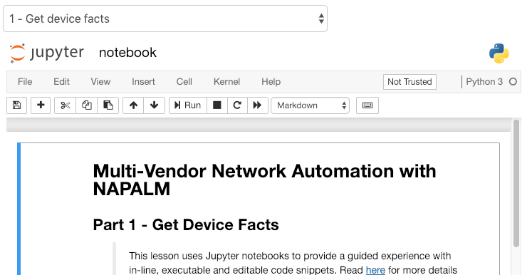
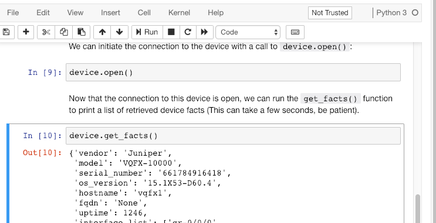
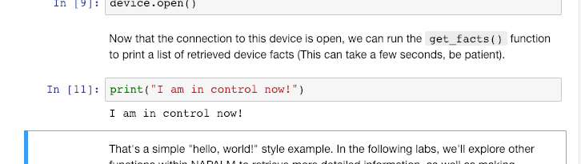

# The Learner's Guide to Jupyter Notebooks

If you encounter a jupyter notebook within a lesson, you might be initially overwhelmed with the number of buttons and options. Don't worry about that - you really only need to know a few key things.

The above image shows the toolbar for a jupyter notebook. You'll find this immediately below the dropdown selector where you can navigate between the labs within a lesson. The main thing you will use here is the "run" button. This is what allows you to execute a selected snippet of code. For instance, in the below image, we have a python snippet embedded in the lab guide. We've selected it, and can execute the code within using this "run" button:

Depending on the snippet, you might see some output below.

Note that you might not get any output. This depends on whether or not the code being executed is meant to produce output, and/or how long it takes to process the instruction.

Also note that most jupyter notebooks expect that you'll run all of the snippets in order. Not doing this might result in some errors. Just follow the instructions in the lab guide if you get stuck.

Finally, you can edit the contents of a notebook! The text and code provided is just part of the lab, but the great thing about jupyter notebooks is that you can play around with them, and download a modified version.

Play around with editing the code provided and running it again! Experiment and learn!

